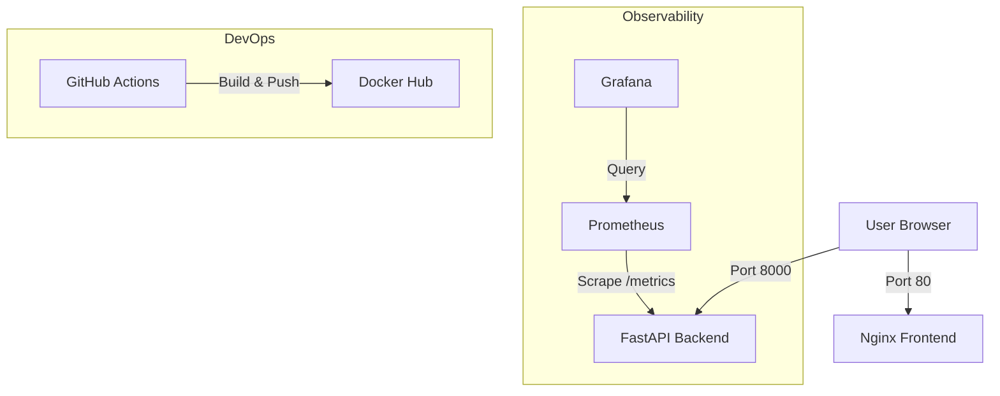

<p align="center">
  
</p>

<h1 align="center">🚀 FusionPact DevOps Challenge: Cloud-Native Showcase</h1>

<p align="center">
  
  
  
  
</p>

---
## Access the Live services:
   - **Frontend**: [http://44.247.12.179/](http://44.247.12.179/)
   - **Backend API**: [http://44.247.12.179:8000/docs](http://44.247.12.179:8000/docs)
   - **Prometheus**: [http://44.247.12.179:9090/targets](http://44.247.12.179:9090/targets)
   - **Grafana**: [http://44.247.12.179:3000](http://44.247.12.179:3000)

--

## 📖 Overview

This repository showcases a complete, production-ready DevOps implementation of a two-tier application. I have transformed a basic code structure into a **fault-tolerant, observable, and automated cloud-native system**. 

The project demonstrates the integration of containerization, monitoring, and automated delivery pipelines to solve real-world infrastructure challenges.

---

## ✨ Highlights & Implementation

Here is a breakdown of what I have achieved in this project:

### 🐳 1. Full-Stack Containerization
- **Backend**: Containerized a **FastAPI** Python application using optimized slim images, exposing an internal API and `/metrics` endpoint.
- **Frontend**: Implemented a lightweight **Nginx** server to host the static internship landing page.
- **Orchestration**: Created a comprehensive `docker-compose.yaml` to manage the multi-service environment (Frontend, Backend, Prometheus, Grafana) with a single command.

### 📊 2. Monitoring & Observability
- **Prometheus Integration**: Configured Prometheus to scrape application-specific metrics from the backend's `/metrics` endpoint.
- **Visual Analytics**: Deployed **Grafana** to provide real-time dashboards for infrastructure health and application performance monitoring (APM).
- **Service Discovery**: Established seamless communication between containers via a dedicated Docker bridge network.

### 🤖 3. Automated CI/CD Pipeline
- **GitHub Actions**: Designed a robust pipeline (`main.yml`) that triggers on every push to the `main` branch.
- **Build & Push**: Automatically builds Docker images for both frontend and backend and pushes them to **Docker Hub**, ensuring a "single source of truth" for deployment artifacts.
- **Secrets Management**: Secured the pipeline using GitHub Secrets for sensitive Docker credentials.

---

## 🛠️ Tech Stack

| Category | Technology |
| :--- | :--- |
| **Backend** | Python (FastAPI), Uvicorn |
| **Frontend** | HTML/CSS, Nginx |
| **Infrastructure** | Docker, Docker Compose |
| **Observability** | Prometheus, Grafana |
| **Automation** | GitHub Actions |
| **Cloud Ready** | Public Cloud (AWS/GCP/Azure) |

---

## 💡 What Problem Does This Solve?

In modern software development, the gap between "code on my machine" and "production-ready systems" is often wide. This project bridges that gap by solving:

1. **Deployment Inconsistency**: By using Docker, we eliminate the "it works on my machine" problem, ensuring identical environments from dev to production.
2. **Monitoring Blind Spots**: Without observability, bugs in production are hard to trace. This setup provides instant visibility into CPU/Memory usage and API response latency.
3. **Manual Overhead**: Automating the build/push process with CI/CD reduces human error and speeds up the delivery cycle.
4. **Scalability**: The architecture is designed to be easily deployed to cloud clusters (like Kubernetes or AWS ECS) with minimal configuration changes.

---

## 🚀 Getting Started

### Prerequisites
- Docker & Docker Compose installed.

### Run Locally
1. Clone the repository:
   ```bash
   git clone https://github.com/your-username/fusionpact-devops-challenge.git
   ```
2. Start the entire stack:
   ```bash
   docker-compose up -d
   ```
3. Access the services:
   - **Frontend**: [http://localhost/](http://localhost/)
   - **Backend API**: [http://localhost:8000/docs](http://localhost:8000/docs)
   - **Prometheus**: [http://localhost:9090/targets](http://localhost:9090/targets)
   - **Grafana**: [http://localhost:3000](http://localhost:3000)

---

## 📐 Architecture



---

<p align="center">
  <b>Built with ❤️ as part of the Fusionpact DevOps Internship Challenge.</b>
</p>

